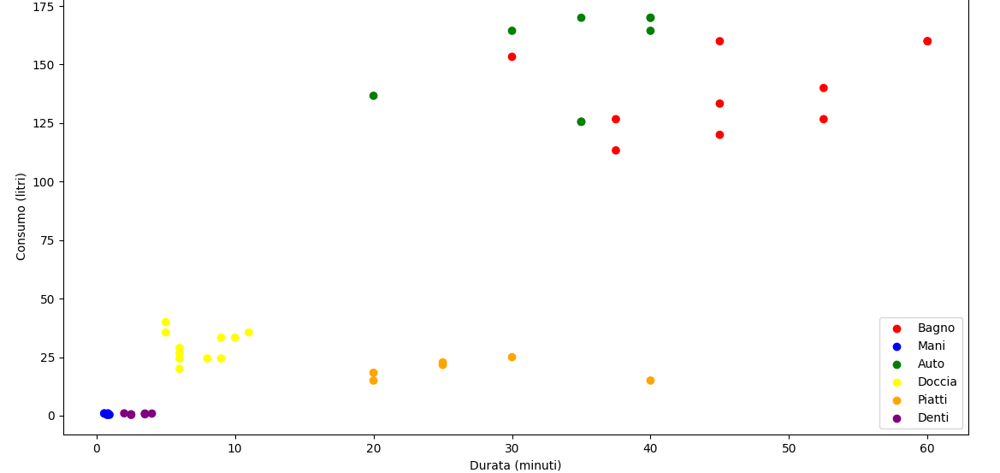
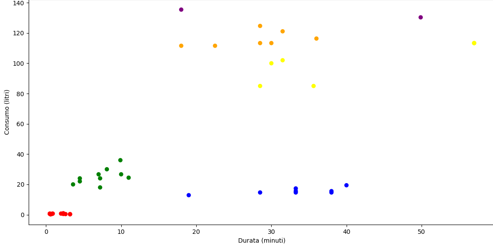

# AquaAware

Il seguente progetto serve per spiegare l'algoritmo che verrà utilizzato per il prodotto AquaAware

Il consumo d'acqua nelle nostre case può avere differenti forme, ad esempio il lavarsi i denti, le mani, farsi una doccia, un bagno, lavare la propria auto, lavare le stoviglie a mano.
Pertanto si è scelto di utilizzare un dataset dove sono memorizzati questi compiti con i relativi consumi e tempo impiegato per ciascuno.

# Prima fase
In questa prima fase iniziale all'interno del dataset `consumo_acqua.csv` ci sono una serie di record (uno per ogni giorno dell'anno) dove per ciascun compito viene espresso il consumo di acqua in litri e il tempo impiegato espresso in minuti.
Chiaramente questi consumi sono frutto di "best practices", cioè di tempi e consumi ritenuti ottimali per svolgere ciascun compito in modo tale da ridurre il consumo di acqua.

Di seguito un grafico che mostra gli esempi presenti nel dataset mappati per compito.

## Apprendimento supervisionato
Il seguente dataset verrà utilizzato per un algoritmo di apprendimento supervisionato come il **Decision Tree**.
Tale algoritmo serve per poter effettuare delle predizioni in base al consumo di acqua e al tempo che il dispositivo sta registrando. Tale predizione verrà usata per fornire una raccomandazione all'utente affichè quest'ultimo possa consumare meno acqua per quel determinato compito predetto dall'algoritmo.
Dunque avremo che l'utente a seguito di un intenso uso del prodotto, avrà cambiato le proprie abitudini e quindi avrà diminuito lo spreco d'acqua per ogni compito.

# Seconda fase
Dopo che il sistema è stato utilizzato dall'utente, e si ha avuto la certezza che ha cambiato le proprie abitudini (mediante un contatore di predizioni corrette ad esempio), il sistema apprenderà, memorizzando gli esempi nel dataset `nofeat_acqua.csv`, dei nuovi consumi e dei nuovi tempi per ogni utilizzo del dispositivo da parte dell'utente.
Questa fase serve affichè l'utente possa ridurre ulteriormente i propri sprechi, in questo modo non solamente rispetterà le best practices (obiettivo della fase 1) ma riuscirà anche a ridurre ulteriormente gli sprechi in modo tale da consumare lo stretto necessario.
Chiaramente le predizioni verranno effettuate dopo che il sistema avrà memorizzato un buon numero di esempi in modo
tale che le predizioni possano essere più accurate possibili e senza che possano essere influenzate dalle prime fasi.

## Apprendimento non supervisionato
Affinchè il sistema possa capire quali sono i compiti, visto che il dispositivo non è in grado autonomamente di classificare gli esempi, viene utilizzato il **K-Means** che è un algoritmo di apprendimento non supervisionato, il quale sarà utilizzato per clusterizzare gli esempi e riuscire ad assegnare la classe a ciascun esempio del dataset.

Di seguito un grafico che mostra gli esempi presenti nel dataset `acqua_etichette.csv` clusterizzati.

Dunque una volta che abbiamo assegnato la classe a ciascun esempio presente nel datase possiamo utilizzare nuovamente un algoritmo di apprendimento supervisionato come il **Decision Tree** per poter effettuare nuovamente le predizioni come visto nella prima fase.

# Scelte progettuali
Come algoritmo di apprendimento supervisionato si è scelto di utilizzare il Decision Tree in quanto oltre a fornire predizioni accurate, come mostrato nel file `DecisionTree.py`, i tempi di risposta sono molto ridotti rispetto ad altri algoritmi come il KNN ad esempio.

Invece come algoritmo di apprendimento non supervisionato si è scelto di utilizzare il K-Means in quanto le classi sono già note a priori e pertanto l'algoritmo non deve capire quali sono i cluster da effettuare ma sono già forniti a priori.

